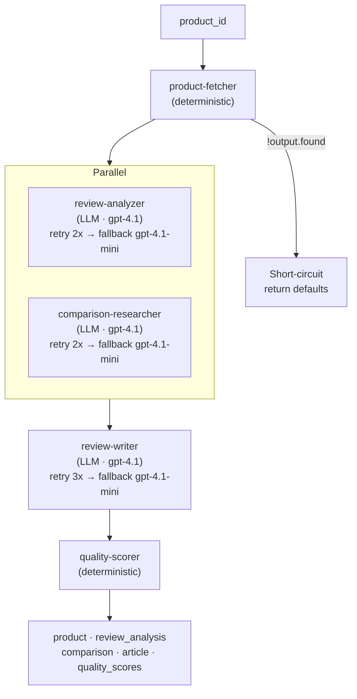
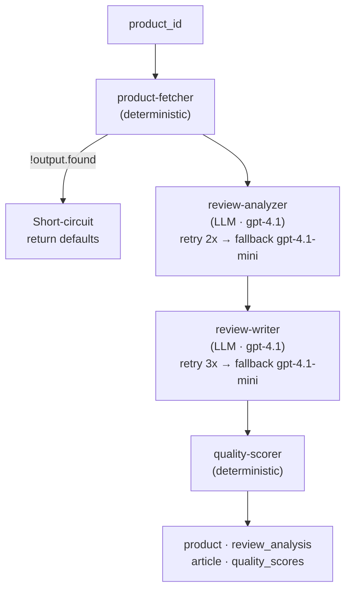

# Building a Go API with Agentic App Spec

Most AI-powered backends follow the same pattern. You start with one LLM call, wrap it in an HTTP handler, and ship it. Then someone asks for a second model in the pipeline. Then a third. Before long you're writing retry loops, threading data between steps, bolting on fallback logic, and parallelizing calls with goroutines and WaitGroups — all tangled into your application code. Every new workflow means more Go code, more tests, more things that can quietly break.

What if the orchestration wasn't in your code at all?

This tutorial walks you through building a product review API from scratch. By the end you'll have three HTTP endpoints — a full review pipeline, a streamlined version, and a standalone comparison agent — backed by five agents and two workflows. The Go code registers two handler functions and mounts three routes. Everything else is YAML.

### product-review (full pipeline)



### quick-review (streamlined)



## Prerequisites

- Go 1.21+
- An OpenAI API key (the agents use `gpt-4.1`)
- The `agentic` CLI ([install instructions](../README.md#install-the-cli))

## Step 1: Scaffold the project

Create a directory and initialize it:

```bash
mkdir product-review-api && cd product-review-api
agentic init
```

This creates:

```
agents/
workflows/
schemas/
agentic.config.yaml
```

Open `agentic.config.yaml` and set the language to Go:

```yaml
lang: go
outdir: src/generated
```

Initialize the Go module and add the runtime dependency:

```bash
go mod init product-review-api
```

Add the runtime to your `go.mod`:

```
require github.com/dcaponi/agentic-app-spec/runtime/go v0.0.0
```

Then run `go mod tidy` (this will fail until we write `main.go` with the import — we'll come back to it).

## Step 2: Add the agents

We need five agents. Two are deterministic (no LLM call), three are LLM-powered. The CLI scaffolds the files; we'll customize each one.

```bash
# Deterministic agents
agentic add agent product-fetcher --type deterministic
agentic add agent quality-scorer --type deterministic

# LLM agents
agentic add agent review-analyzer --type llm
agentic add agent comparison-researcher --type llm
agentic add agent review-writer --type llm
```

Run `agentic list` to confirm:

```
Agents
------
  comparison-researcher  type=llm model=gpt-4.1 prompt.md=yes
  product-fetcher  type=deterministic
  quality-scorer  type=deterministic
  review-analyzer  type=llm model=gpt-4.1 prompt.md=yes
  review-writer  type=llm model=gpt-4.1 prompt.md=yes
```

The CLI generates stub YAML with placeholder inputs. Now we customize each agent for our domain.

### product-fetcher (deterministic)

This agent calls the DummyJSON API and returns product data. Replace the contents of `agents/product-fetcher/agent.yaml`:

```yaml
name: Product Fetcher
description: Fetches product data and reviews from DummyJSON API
type: deterministic
handler: product_fetch

input:
  product_id:
    type: number
    required: true
```

The `handler` field is the name you'll register in Go with `engine.RegisterHandler("product_fetch", ...)`. No LLM, no prompt — just a function.

### review-analyzer (LLM)

Analyzes reviews for sentiment, themes, and key insights. Replace `agents/review-analyzer/agent.yaml`:

```yaml
name: Review Analyzer
description: Analyzes product reviews for sentiment, themes, and key insights
type: llm
model: gpt-4.1
temperature: 0.2
input_type: text
schema: review_analysis
user_message: "Analyze the following product data and customer reviews.\n\nProduct: {{product_name}}\nCategory: {{category}}\nPrice: ${{price}}\nRating: {{rating}}/5\n\nReviews:\n{{reviews_text}}\n\nProvide a structured analysis."

input:
  product_name:
    type: string
    required: true
  category:
    type: string
    required: true
  price:
    type: number
    required: true
  rating:
    type: number
    required: true
  reviews_text:
    type: string
    required: true
```

Key fields:
- **`schema: review_analysis`** references a JSON schema we'll create in `schemas/`. The runtime forces the model to conform to it.
- **`user_message`** uses `{{key}}` interpolation. At runtime, the engine replaces these with the resolved input values.
- **`temperature: 0.2`** keeps output deterministic — we want structured extraction, not creative writing.

Replace `agents/review-analyzer/prompt.md` with the system prompt:

```markdown
You are a product review analyst. Your job is to analyze customer reviews for a given product and produce a structured, objective analysis.

## Your Task

1. **Determine Overall Sentiment**: Classify as "positive", "negative", or "mixed".
2. **Identify Top 3 Pros**: Concise statements supported by review evidence.
3. **Identify Top 3 Cons**: Concise statements supported by review evidence.
4. **Identify Common Themes**: 3-5 recurring topics (e.g., "build quality", "value for money").
5. **Rate Overall Quality**: 1-5 integer scale based on the reviews.

## Guidelines

- Be objective. Every claim must be traceable to the review text.
- Do not fabricate reviews or sentiments not present in the input.
- Your output must conform to the `review_analysis` schema.
```

### comparison-researcher (LLM)

Researches competing products. Replace `agents/comparison-researcher/agent.yaml`:

```yaml
name: Comparison Researcher
description: Researches and compares the product against similar alternatives
type: llm
model: gpt-4.1
temperature: 0.3
input_type: text
schema: comparison_report
user_message: "Research alternatives to this product and provide a comparison.\n\nProduct: {{product_name}}\nCategory: {{category}}\nPrice: ${{price}}\nBrand: {{brand}}\nDescription: {{description}}\n\nIdentify 2-3 comparable alternatives and compare them."

input:
  product_name:
    type: string
    required: true
  category:
    type: string
    required: true
  price:
    type: number
    required: true
  brand:
    type: string
    required: true
  description:
    type: string
    required: true
```

Replace `agents/comparison-researcher/prompt.md`:

```markdown
You are a product comparison researcher. Identify real competing products and provide a fair, factual comparison.

## Your Task

1. **Identify 2-3 Comparable Alternatives** in the same category and price range.
2. **Compare on**: features, price, quality, and user satisfaction.
3. **Provide a Recommendation**: label each as "best value", "best premium", or "best budget" where appropriate.

## Guidelines

- Only reference real products and brands.
- If uncertain about a detail, state the uncertainty rather than fabricating.
- Your output must conform to the `comparison_report` schema.
```

### review-writer (LLM)

Synthesizes analysis and comparison data into a review article. Replace `agents/review-writer/agent.yaml`:

```yaml
name: Review Writer
description: Writes a comprehensive product review article from analysis data
type: llm
model: gpt-4.1
temperature: 0.4
input_type: text
schema: null
user_message: "Write a comprehensive product review based on the following data.\n\nProduct: {{product_name}} by {{brand}}\nPrice: ${{price}}\n\nReview Analysis:\n{{review_analysis}}\n\nComparison Report:\n{{comparison_report}}\n\nWrite an engaging, balanced review article with sections for Overview, Pros & Cons, How It Compares, and Final Verdict. Return as JSON with fields: title, overview, pros_cons, comparison, verdict, rating (1-10)."

input:
  product_name:
    type: string
    required: true
  brand:
    type: string
    required: true
  price:
    type: number
    required: true
  review_analysis:
    type: object
    required: true
  comparison_report:
    type: object
    required: true
```

Note `schema: null` — this tells the runtime to use JSON mode (model returns valid JSON) without constraining the shape. We describe the shape in the `user_message` instead.

Replace `agents/review-writer/prompt.md`:

```markdown
You are a professional product review writer. Synthesize analysis and comparison data into a polished review article.

## Sections

1. **Title**: Engaging headline.
2. **Overview**: 2-3 paragraph introduction.
3. **Pros & Cons**: Balanced breakdown referencing the analysis.
4. **How It Compares**: Compare against alternatives by name.
5. **Final Verdict**: Clear recommendation with justification.
6. **Rating**: 1-10 scale.

## Guidelines

- Be balanced — mention both strengths and weaknesses.
- Reference specific data points from the analysis and comparison.
- Your output must be valid JSON with fields: title, overview, pros_cons, comparison, verdict, rating.
```

### quality-scorer (deterministic)

Scores the generated article with a heuristic. Replace `agents/quality-scorer/agent.yaml`:

```yaml
name: Quality Scorer
description: Deterministic scoring of the generated review on structure, completeness, and quality
type: deterministic
handler: quality_scoring

input:
  review_article:
    type: object
    required: true
  review_analysis:
    type: object
    required: true
  comparison_report:
    type: object
    required: true
```

No prompt file needed — this is pure code.

## Step 3: Create the schemas

LLM agents that use structured output need a JSON schema. Create two files in `schemas/`:

**`schemas/review_analysis.json`**:

```json
{
  "name": "review_analysis",
  "strict": true,
  "schema": {
    "type": "object",
    "properties": {
      "sentiment": { "type": "string", "enum": ["positive", "negative", "mixed"] },
      "pros": { "type": "array", "items": { "type": "string" } },
      "cons": { "type": "array", "items": { "type": "string" } },
      "themes": { "type": "array", "items": { "type": "string" } },
      "quality_rating": { "type": "number" }
    },
    "required": ["sentiment", "pros", "cons", "themes", "quality_rating"],
    "additionalProperties": false
  }
}
```

**`schemas/comparison_report.json`**:

```json
{
  "name": "comparison_report",
  "strict": true,
  "schema": {
    "type": "object",
    "properties": {
      "alternatives": {
        "type": "array",
        "items": {
          "type": "object",
          "properties": {
            "name": { "type": "string" },
            "price": { "type": "number" },
            "pros": { "type": "array", "items": { "type": "string" } },
            "cons": { "type": "array", "items": { "type": "string" } }
          },
          "required": ["name", "price", "pros", "cons"],
          "additionalProperties": false
        }
      },
      "recommendation": { "type": "string" }
    },
    "required": ["alternatives", "recommendation"],
    "additionalProperties": false
  }
}
```

## Step 4: Add the workflows

```bash
agentic add workflow product-review --agents product-fetcher,review-analyzer,comparison-researcher,review-writer,quality-scorer
agentic add workflow quick-review --agents product-fetcher,review-analyzer,review-writer,quality-scorer
```

The CLI scaffolds sequential steps with placeholder inputs. Now we customize them with data bindings, parallel blocks, short-circuits, and fallbacks.

### product-review (full pipeline)

Replace `workflows/product-review.yaml`:

```yaml
name: product-review
description: End-to-end product review pipeline
version: "1.0"

input:
  product_id:
    type: number
    required: true

steps:
  - id: fetch
    agent: product-fetcher
    input:
      product_id: $.input.product_id
    short_circuit:
      condition: "!output.found"
      defaults:
        review_analysis: { sentiment: "unknown", pros: [], cons: [], themes: [], quality_rating: 0 }
        comparison: { alternatives: [], recommendation: "N/A" }
        article: { title: "Product Not Found", overview: "The requested product could not be found.", pros_cons: "", comparison: "", verdict: "N/A", rating: 0 }
        quality: { structure_score: 0, completeness_score: 0, tone_score: 0, overall: 0 }

  - parallel:
    - id: review_analysis
      agent: review-analyzer
      input:
        product_name: $.steps.fetch.output.title
        category: $.steps.fetch.output.category
        price: $.steps.fetch.output.price
        rating: $.steps.fetch.output.rating
        reviews_text: $.steps.fetch.output.reviews_text
      retry:
        max_attempts: 2
        backoff_ms: 500
      fallback:
        agent: review-analyzer
        config:
          model: gpt-4.1-mini

    - id: comparison
      agent: comparison-researcher
      input:
        product_name: $.steps.fetch.output.title
        category: $.steps.fetch.output.category
        price: $.steps.fetch.output.price
        brand: $.steps.fetch.output.brand
        description: $.steps.fetch.output.description
      retry:
        max_attempts: 2
        backoff_ms: 500
      fallback:
        agent: comparison-researcher
        config:
          model: gpt-4.1-mini

  - id: article
    agent: review-writer
    input:
      product_name: $.steps.fetch.output.title
      brand: $.steps.fetch.output.brand
      price: $.steps.fetch.output.price
      review_analysis: $.steps.review_analysis.output
      comparison_report: $.steps.comparison.output
    retry:
      max_attempts: 3
      backoff_ms: 1000
    fallback:
      agent: review-writer
      config:
        model: gpt-4.1-mini

  - id: quality
    agent: quality-scorer
    input:
      review_article: $.steps.article.output
      review_analysis: $.steps.review_analysis.output
      comparison_report: $.steps.comparison.output

output:
  product: $.steps.fetch.output
  review_analysis: $.steps.review_analysis.output
  comparison: $.steps.comparison.output
  article: $.steps.article.output
  quality_scores: $.steps.quality.output
```

A lot is happening here and none of it is in Go:

- **Data binding**: `$.steps.fetch.output.title` threads the product title from step 1 into steps 2, 3, and 4. No intermediate variables, no struct passing.
- **Parallel execution**: `review_analysis` and `comparison` run concurrently in goroutines. The engine handles the WaitGroup.
- **Retry with backoff**: Both LLM steps retry up to 2 times with 500ms backoff before falling back.
- **Fallback**: If retries are exhausted, the same agent is re-invoked with a cheaper model (`gpt-4.1-mini`).
- **Short-circuit**: If the product isn't found, the entire pipeline skips the remaining steps and returns defaults.
- **Output mapping**: The `output` section assembles the final response from across all steps.

### quick-review (streamlined)

Replace `workflows/quick-review.yaml`:

```yaml
name: quick-review
description: Streamlined review — no comparison research
version: "1.0"

input:
  product_id:
    type: number
    required: true

steps:
  - id: fetch
    agent: product-fetcher
    input:
      product_id: $.input.product_id
    short_circuit:
      condition: "!output.found"
      defaults:
        review_analysis: { sentiment: "unknown", pros: [], cons: [], themes: [], quality_rating: 0 }
        article: { title: "Product Not Found", overview: "The requested product could not be found.", pros_cons: "", comparison: "", verdict: "N/A", rating: 0 }
        quality: { structure_score: 0, completeness_score: 0, tone_score: 0, overall: 0 }

  - id: review_analysis
    agent: review-analyzer
    input:
      product_name: $.steps.fetch.output.title
      category: $.steps.fetch.output.category
      price: $.steps.fetch.output.price
      rating: $.steps.fetch.output.rating
      reviews_text: $.steps.fetch.output.reviews_text
    retry:
      max_attempts: 2
      backoff_ms: 500
    fallback:
      agent: review-analyzer
      config:
        model: gpt-4.1-mini

  - id: article
    agent: review-writer
    input:
      product_name: $.steps.fetch.output.title
      brand: $.steps.fetch.output.brand
      price: $.steps.fetch.output.price
      review_analysis: $.steps.review_analysis.output
      comparison_report: {}
    retry:
      max_attempts: 3
      backoff_ms: 1000
    fallback:
      agent: review-writer
      config:
        model: gpt-4.1-mini

  - id: quality
    agent: quality-scorer
    input:
      review_article: $.steps.article.output
      review_analysis: $.steps.review_analysis.output
      comparison_report: {}

output:
  product: $.steps.fetch.output
  review_analysis: $.steps.review_analysis.output
  article: $.steps.article.output
  quality_scores: $.steps.quality.output
```

Key differences: no `parallel:` block, `comparison_report` hardcoded to `{}`, no comparison in the output. Adding this workflow required zero new Go code — just a new YAML file and one line to mount the route.

## Step 5: Write the Go code

Now the only Go code — `main.go`. It does three things:

1. Registers two deterministic handlers
2. Mounts three HTTP endpoints
3. Starts the server

```go
package main

import (
    "encoding/json"
    "fmt"
    "io"
    "log"
    "net/http"
    "strconv"
    "strings"

    engine "github.com/dcaponi/agentic-app-spec/runtime/go"
)

func main() {
    engine.RegisterHandler("product_fetch", productFetchHandler)
    engine.RegisterHandler("quality_scoring", qualityScoringHandler)

    http.HandleFunc("/review", handleReview)
    http.HandleFunc("/quick-review", handleQuickReview)
    http.HandleFunc("/comparison", handleComparison)

    fmt.Println("Listening on :8080")
    log.Fatal(http.ListenAndServe(":8080", nil))
}
```

The `/review` and `/quick-review` handlers are nearly identical — the only difference is the workflow name:

```go
func handleReview(w http.ResponseWriter, r *http.Request) {
    productID, err := parseProductID(r)
    if err != nil {
        http.Error(w, `{"error":"product_id must be a number"}`, http.StatusBadRequest)
        return
    }

    envelope, err := engine.Orchestrate("product-review", map[string]interface{}{
        "product_id": productID,
    })
    if err != nil {
        writeError(w, err)
        return
    }

    w.Header().Set("Content-Type", "application/json")
    json.NewEncoder(w).Encode(envelope)
}
```

The `/comparison` endpoint skips the workflow and invokes a single agent directly:

```go
result, err := engine.InvokeAgent("comparison-researcher", map[string]interface{}{
    "product_name": product["title"],
    "category":     product["category"],
    "price":        product["price"],
    "brand":        product["brand"],
    "description":  product["description"],
})
```

### The deterministic handlers

**`productFetchHandler`** calls `https://dummyjson.com/products/{id}`, extracts product data and reviews, and returns a structured map. If the product isn't found, it returns `"found": false` which triggers the workflow's short-circuit.

**`qualityScoringHandler`** scores the generated article on three dimensions:
- **Structure** (0-100): Does the article have all expected sections (title, overview, pros_cons, comparison, verdict, rating)?
- **Completeness** (0-100): Were both upstream data sources (analysis + comparison) used?
- **Tone** (0-100): Is the article substantive enough based on character length?

The overall score is the average of the three.

The full `main.go` is in the [test-go-project](../test-go-project/main.go) directory.

Now finish setting up the Go module:

```bash
go mod tidy
go build ./...
```

## Step 6: Generate typed handles (optional)

```bash
agentic build --lang go
```

This generates type-safe Go functions in `src/generated/` for each agent and workflow:

```go
// src/generated/workflows/product_review.go
type ProductReviewInput struct {
    ProductId float64 `json:"product_id"`
}

func ProductReview(input ProductReviewInput) (*engine.WorkflowEnvelope, error) {
    return engine.Orchestrate("product-review", input)
}
```

These are convenience wrappers — you can use them instead of calling `engine.Orchestrate` with raw maps. Useful for compile-time type checking and IDE autocomplete.

## Step 7: Run it

```bash
export OPENAI_API_KEY=sk-...
go run .
```

In another terminal:

```bash
# Full pipeline — fetch, parallel analysis + comparison, article, quality scoring
curl -s "http://localhost:8080/review?product_id=1" | jq

# No comparison — faster, cheaper, still gets you a review
curl -s "http://localhost:8080/quick-review?product_id=1" | jq

# Just the comparison agent
curl -s "http://localhost:8080/comparison?product_id=42" | jq
```

Product IDs 1 through 194 are valid on the DummyJSON API. The full pipeline takes around 10-15 seconds (two parallel LLM calls + one serial). The quick review is a few seconds faster.

## What you get back

Every workflow returns a `WorkflowEnvelope` — a standardized response with the workflow name, version, request ID, timestamps, per-step results with latency and token metrics, and the final assembled output:

```json
{
  "workflow": "product-review",
  "version": "1.0",
  "request_id": "wf_dc905347-2667-4168-8fbe-285e36e39330",
  "status": "success",
  "timestamps": {
    "started_at": "2026-03-22T18:19:37Z",
    "completed_at": "2026-03-22T18:19:49Z"
  },
  "metrics": {
    "total_latency_ms": 12737,
    "total_input_tokens": 1977,
    "total_output_tokens": 880
  },
  "steps": [
    { "id": "fetch", "status": "success", "output": { "title": "Essence Mascara Lash Princess", "..." : "..." } },
    { "id": "review_analysis", "status": "success", "output": { "sentiment": "mixed", "..." : "..." } },
    { "id": "comparison", "status": "success", "output": { "alternatives": ["..."], "..." : "..." } },
    { "id": "article", "status": "success", "output": { "title": "Big Drama on a Budget", "..." : "..." } },
    { "id": "quality", "status": "success", "output": { "overall": 96.67 } }
  ],
  "result": {
    "product": { "..." : "..." },
    "review_analysis": { "..." : "..." },
    "comparison": { "..." : "..." },
    "article": { "..." : "..." },
    "quality_scores": { "..." : "..." }
  }
}
```

## What to take away

The Go code does exactly two things: implements business logic that can't be expressed declaratively (fetching from an API, scoring with a heuristic), and mounts HTTP handlers that delegate to the engine.

Everything else — which agents to call, in what order, in parallel or serial, with what retry and fallback behavior, how data flows between steps, what to do when a product isn't found, and how to assemble the final response — lives in YAML.

Want to add a sixth agent? Write the YAML and prompt, add a step to the workflow. Want a third workflow? Copy-paste the YAML and modify. Want to swap gpt-4.1 for a different model? Change one line. None of it requires recompiling your Go code.

The same pattern works in TypeScript, Python, and Ruby — different runtimes, same YAML definitions. See the [README](../README.md) for setup instructions in each language.
