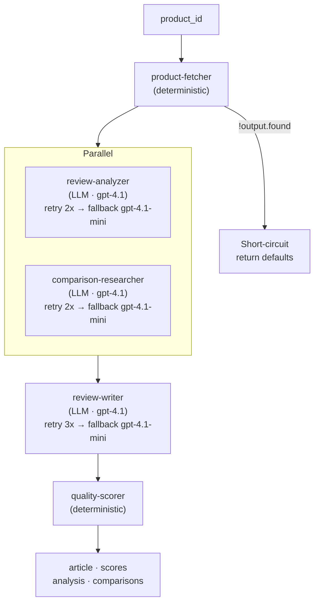

# Tutorial: Build a Product Review Pipeline with Agentic App Spec

In this tutorial, you will build a complete multi-agent pipeline that takes a product ID, fetches data from a free public API, analyzes reviews, researches alternatives, writes a comprehensive review article, and scores the output. The pipeline uses five agents -- two deterministic and three LLM-powered -- with parallel execution, retry logic, fallback models, and short-circuit early exit.

By the end, you will have a working project that demonstrates the core features of Agentic App Spec: file-tree agent definitions, declarative workflow orchestration, and typed code generation.

---

## What We're Building

Here is the pipeline at a glance:

1. **product-fetcher** (deterministic) -- Fetches product data from `dummyjson.com/products/{id}`, a free API that requires no authentication.
2. **review-analyzer** (LLM) -- Analyzes the product's reviews for sentiment, pros, and cons.
3. **comparison-researcher** (LLM) -- Researches alternative products in the same category. Runs in parallel with the review analyzer.
4. **review-writer** (LLM) -- Takes all the gathered data and writes a comprehensive review article.
5. **quality-scorer** (deterministic) -- Scores the article on several dimensions using heuristic rules.

The data flows like this: the fetcher provides raw product data that feeds into the analyzer and researcher (running concurrently). Their outputs feed into the writer. The writer's output feeds into the scorer. If the product is not found, the pipeline short-circuits immediately.



---

## Prerequisites

- The **agentic** CLI installed (download from [releases](https://github.com/dcaponi/agentic-app-spec/releases) or build from source with `cd cli && cargo build --release`)
- An **OpenAI API key** (set as the `OPENAI_API_KEY` environment variable)
- Basic comfort with the terminal and a text editor

---

## Step 1: Initialize the Project

Create a new directory and scaffold the project:

```bash
mkdir product-review-app && cd product-review-app
agentic init
```

This creates the base directory structure:

```
product-review-app/
  agents/
  workflows/
  schemas/
  generated/
  agentic.config.yaml
```

The `agents/` directory will hold your agent definitions. The `workflows/` directory will hold your orchestration files. The `schemas/` directory is for JSON Schema files that define structured outputs. The `generated/` directory is where the CLI writes generated code.

---

## Step 2: Define the Agents

We will create each agent one at a time. Every agent lives in its own folder under `agents/`.

### Agent 1: product-fetcher

This is a deterministic agent. It does not call an LLM -- it runs a handler function that you will implement in your application code. Its job is to call the dummyjson.com API and return the product data.

Create the file `agents/product-fetcher/agent.yaml`:

```yaml
id: product-fetcher
name: Product Fetcher
type: deterministic
handler: product_fetch
input:
  product_id: number
output_schema: null
```

There is no `prompt.md` for this agent because it does not interact with an LLM. The `handler` field declares the name of a function you will register in your runtime harness. The `type: deterministic` flag tells the orchestrator that this step does not need an LLM client.

### Agent 2: review-analyzer

This is an LLM agent that analyzes product reviews for sentiment, key pros, and key cons. It returns structured output conforming to a JSON Schema.

Create the file `agents/review-analyzer/agent.yaml`:

```yaml
id: review-analyzer
name: Review Analyzer
type: llm
model: gpt-4.1
temperature: 0.3
input:
  product_name: string
  reviews: "array<object>"
output_schema: ./schemas/review-analysis.json
system_message: prompt.md
user_message: |
  Analyze the following reviews for "{{product_name}}".

  Reviews:
  {{reviews}}

  Return structured analysis with sentiment, pros, and cons.
```

Now create the prompt file `agents/review-analyzer/prompt.md`:

```markdown
You are a product review analyst. Given a set of customer reviews for a product,
you analyze them and produce a structured summary.

Your analysis must include:
- **Overall sentiment**: positive, negative, or mixed
- **Confidence score**: 0.0 to 1.0 indicating how confident you are in the sentiment
- **Key pros**: A list of the most frequently praised aspects
- **Key cons**: A list of the most frequently criticized aspects
- **Summary**: A 2-3 sentence summary of the overall review landscape

Be objective. Base your analysis only on the review content provided. Do not invent
details not present in the reviews.
```

Create the schema file `schemas/review-analysis.json`:

```json
{
  "$schema": "https://json-schema.org/draft/2020-12/schema",
  "type": "object",
  "properties": {
    "sentiment": {
      "type": "string",
      "enum": ["positive", "negative", "mixed"]
    },
    "confidence": {
      "type": "number",
      "minimum": 0,
      "maximum": 1
    },
    "pros": {
      "type": "array",
      "items": { "type": "string" }
    },
    "cons": {
      "type": "array",
      "items": { "type": "string" }
    },
    "summary": {
      "type": "string"
    }
  },
  "required": ["sentiment", "confidence", "pros", "cons", "summary"]
}
```

Notice the `user_message` field in the YAML uses `{{product_name}}` and `{{reviews}}` template placeholders. At runtime, these are replaced with the actual values resolved from the workflow context. The `output_schema` points to the JSON Schema file, which tells the LLM to return structured output matching that shape.

### Agent 3: comparison-researcher

This agent researches alternative products in the same category. It will run in parallel with the review analyzer.

Create `agents/comparison-researcher/agent.yaml`:

```yaml
id: comparison-researcher
name: Comparison Researcher
type: llm
model: gpt-4.1
temperature: 0.5
input:
  product_name: string
  category: string
output_schema: ./schemas/comparison-research.json
system_message: prompt.md
user_message: |
  Research alternatives to "{{product_name}}" in the "{{category}}" category.

  Suggest 3-5 comparable products with brief explanations of how they compare.
```

Create `agents/comparison-researcher/prompt.md`:

```markdown
You are a product research specialist. Given a product name and category, you
identify comparable alternatives that a consumer should consider.

For each alternative, provide:
- **Name**: The product name
- **Price range**: Approximate price positioning (budget, mid-range, premium)
- **Key differentiator**: What makes this alternative worth considering
- **Trade-off**: What you give up compared to the original product

Focus on well-known, widely available products. Be specific and factual.
```

Create `schemas/comparison-research.json`:

```json
{
  "$schema": "https://json-schema.org/draft/2020-12/schema",
  "type": "object",
  "properties": {
    "alternatives": {
      "type": "array",
      "items": {
        "type": "object",
        "properties": {
          "name": { "type": "string" },
          "price_range": { "type": "string" },
          "key_differentiator": { "type": "string" },
          "trade_off": { "type": "string" }
        },
        "required": ["name", "price_range", "key_differentiator", "trade_off"]
      }
    }
  },
  "required": ["alternatives"]
}
```

### Agent 4: review-writer

This agent takes the product data, review analysis, and comparison research, and writes a comprehensive review article. Note that `output_schema` is set to `null` here -- we want free-form text output, not structured JSON.

Create `agents/review-writer/agent.yaml`:

```yaml
id: review-writer
name: Review Writer
type: llm
model: gpt-4.1
temperature: 0.7
input:
  product_name: string
  analysis: object
  alternatives: object
output_schema: null
system_message: prompt.md
user_message: |
  Write a comprehensive review article for "{{product_name}}".

  Review Analysis:
  {{analysis}}

  Competitive Alternatives:
  {{alternatives}}

  Write a well-structured article of 500-800 words.
```

Create `agents/review-writer/prompt.md`:

```markdown
You are a professional product review writer. You produce engaging, balanced,
and informative review articles based on structured analysis and research data.

Your articles should include:
- An engaging introduction
- A section on what the product does well (based on the pros from analysis)
- A section on areas for improvement (based on the cons from analysis)
- A comparison with alternatives
- A clear verdict with a recommendation

Write in a professional but accessible tone. Use specific details from the
provided data. Do not fabricate features or specs not present in the input.
```

### Agent 5: quality-scorer

This is the second deterministic agent. It runs your custom scoring logic against the generated article -- checking things like word count, whether it mentions pros and cons, and structural completeness.

Create `agents/quality-scorer/agent.yaml`:

```yaml
id: quality-scorer
name: Quality Scorer
type: deterministic
handler: quality_scoring
input:
  article: string
output_schema: null
```

No prompt file needed. The scoring logic will live in the handler function you register.

---

## Step 3: Define the Workflow

Now we tie everything together. Create `workflows/product-review.yaml`:

```yaml
name: product-review
version: "1.0"
description: >
  Fetches a product from dummyjson.com, analyzes its reviews,
  researches alternatives, writes a review article, and scores it.

input:
  product_id: number

steps:
  - id: fetch
    agent: product-fetcher
    input:
      product_id: "$.input.product_id"
    short_circuit:
      condition: "$.steps.fetch.output == null"
      message: "Product not found for the given ID"

  - parallel:
      - id: analyze
        agent: review-analyzer
        input:
          product_name: "$.steps.fetch.output.title"
          reviews: "$.steps.fetch.output.reviews"
        retry:
          max_attempts: 2

      - id: research
        agent: comparison-researcher
        input:
          product_name: "$.steps.fetch.output.title"
          category: "$.steps.fetch.output.category"
        retry:
          max_attempts: 2

  - id: write
    agent: review-writer
    input:
      product_name: "$.steps.fetch.output.title"
      analysis: "$.steps.analyze.output"
      alternatives: "$.steps.research.output"
    retry:
      max_attempts: 2
      fallback:
        agent: review-writer
        model_override: gpt-4.1-mini

  - id: score
    agent: quality-scorer
    input:
      article: "$.steps.write.output"

output:
  article: "$.steps.write.output"
  scores: "$.steps.score.output"
  analysis: "$.steps.analyze.output"
  alternatives: "$.steps.research.output"
```

Let's walk through the key sections.

**Input.** The workflow accepts a single `product_id` of type `number`. This is what the caller passes when invoking the pipeline.

**Step 1: fetch.** The `product-fetcher` agent receives `$.input.product_id`, which resolves to whatever the caller passed in. After this step executes, its output is available as `$.steps.fetch.output`. The `short_circuit` block checks if the output is null. If it is -- meaning the API returned no product for that ID -- the workflow exits immediately with the message "Product not found for the given ID." No further steps execute.

**Step 2: parallel group.** The `analyze` and `research` steps are wrapped in a `parallel` block, so they execute concurrently. Both reference `$.steps.fetch.output` to pull data from the fetch step's result. Each has `retry.max_attempts: 2`, meaning the orchestrator will retry once on failure before giving up.

**Step 3: write.** This step depends on both parallel steps completing. It pulls `$.steps.analyze.output` and `$.steps.research.output` as inputs. It has a retry policy with a fallback: if both retry attempts with `gpt-4.1` fail, the orchestrator falls back to running the same agent with `gpt-4.1-mini` as the model. This is useful for resilience -- the smaller model is less likely to hit rate limits or timeout, and a slightly lower-quality article is better than no article.

**Step 4: score.** The deterministic scoring step receives the article text and runs the handler.

**Output.** The output section declares which step results to include in the final response. The binding syntax maps each output field to a specific step's output.

---

## Step 4: Generate the Code

With all agents and the workflow defined, generate the typed code:

```bash
agentic build --lang typescript
```

This reads every file in `agents/` and `workflows/`, validates them, and writes generated code to `generated/`. After running, you will see:

```
generated/
  workflows/
    productReview.ts
  types/
    productFetcher.ts
    reviewAnalyzer.ts
    comparisonResearcher.ts
    reviewWriter.ts
    qualityScorer.ts
  index.ts
```

The generated `productReview.ts` exports a function with this signature:

```typescript
export async function productReview(
  input: ProductReviewInput
): Promise<WorkflowEnvelope<ProductReviewOutput>>;
```

The `ProductReviewInput` type is:

```typescript
export interface ProductReviewInput {
  product_id: number;
}
```

And `ProductReviewOutput` reflects the `output` section of the workflow YAML:

```typescript
export interface ProductReviewOutput {
  article: string;
  scores: QualityScorerOutput;
  analysis: ReviewAnalysisOutput;
  alternatives: ComparisonResearchOutput;
}
```

Your IDE will provide autocompletion for all of these types. If you mistype an input field or try to access an output field that does not exist, the compiler catches it.

---

## Step 5: Wire It Up

The generated code handles orchestration, but you need to provide two things: the runtime (LLM client configuration) and the deterministic handlers. Create a file `src/index.ts`:

```typescript
import { createRuntime } from "./generated";
import { productReview } from "./generated/workflows/productReview";

// Register deterministic handlers
const runtime = createRuntime({
  openaiApiKey: process.env.OPENAI_API_KEY!,

  handlers: {
    product_fetch: async (input: { product_id: number }) => {
      const res = await fetch(
        `https://dummyjson.com/products/${input.product_id}`
      );
      if (!res.ok) return null;
      return res.json();
    },

    quality_scoring: async (input: { article: string }) => {
      const article = input.article;
      const wordCount = article.split(/\s+/).length;
      const hasProsSection = /what.*does well|strengths|pros/i.test(article);
      const hasConsSection = /areas for improvement|weaknesses|cons/i.test(article);
      const hasVerdict = /verdict|recommendation|conclusion/i.test(article);

      const scores = {
        word_count: wordCount,
        meets_length: wordCount >= 500 && wordCount <= 1000,
        has_pros_section: hasProsSection,
        has_cons_section: hasConsSection,
        has_verdict: hasVerdict,
        overall: Math.round(
          ((wordCount >= 500 ? 25 : (wordCount / 500) * 25) +
            (hasProsSection ? 25 : 0) +
            (hasConsSection ? 25 : 0) +
            (hasVerdict ? 25 : 0))
        ),
      };
      return scores;
    },
  },
});

// Run the pipeline
async function main() {
  const result = await runtime.execute(productReview, {
    product_id: 42,
  });

  console.log("Status:", result.status);
  console.log("Article preview:", result.output.article.substring(0, 200));
  console.log("Quality score:", result.output.scores.overall);
  console.log("Sentiment:", result.output.analysis.sentiment);
  console.log("Total time:", result.metrics.total_duration_ms, "ms");
}

main().catch(console.error);
```

The `handlers` object maps handler names (declared in the agent YAML `handler` field) to actual functions. The `product_fetch` handler calls the dummyjson.com API. The `quality_scoring` handler runs heuristic checks on the article text. These could be as simple or as sophisticated as you need.

---

## Step 6: Run It

Execute the pipeline:

```bash
npx tsx src/index.ts
```

You should see output like this:

```
Status: success
Article preview: # Comprehensive Review: Product XYZ  In the ever-evolving landscape of consumer electronics, finding the right product can be...
Quality score: 82
Sentiment: positive
Total time: 4523 ms
```

The full response envelope returned by the runtime looks like this:

```json
{
  "workflow": "product-review",
  "status": "success",
  "output": {
    "article": "# Comprehensive Review: Product XYZ\n\nIn the ever-evolving...",
    "scores": {
      "word_count": 623,
      "meets_length": true,
      "has_pros_section": true,
      "has_cons_section": true,
      "has_verdict": true,
      "overall": 100
    },
    "analysis": {
      "sentiment": "positive",
      "confidence": 0.85,
      "pros": ["Excellent build quality", "Great battery life"],
      "cons": ["Slightly overpriced", "Limited color options"],
      "summary": "Reviews are predominantly positive, praising build quality..."
    },
    "alternatives": {
      "alternatives": [
        {
          "name": "Competitor A",
          "price_range": "mid-range",
          "key_differentiator": "Better value for money",
          "trade_off": "Lower build quality"
        }
      ]
    }
  },
  "metrics": {
    "total_duration_ms": 4523,
    "steps": {
      "fetch": { "status": "success", "duration_ms": 210, "retries": 0 },
      "analyze": { "status": "success", "duration_ms": 1802, "retries": 0 },
      "research": { "status": "success", "duration_ms": 2105, "retries": 0 },
      "write": { "status": "success", "duration_ms": 1980, "retries": 1, "used_fallback": false },
      "score": { "status": "success", "duration_ms": 45, "retries": 0 }
    }
  }
}
```

The `metrics` section shows you exactly what happened: the write step was retried once (perhaps a transient API error), but the fallback model was not needed. The parallel steps (analyze and research) overlap in time, so the total duration is less than the sum of all step durations.

---

## What's Happening Under the Hood

Here is the full execution trace for a successful run:

1. The orchestrator loads the `product-review` workflow definition and all referenced agent definitions.
2. It resolves `$.input.product_id` to `42` from the caller's input.
3. It executes the `product-fetcher` handler, which calls `https://dummyjson.com/products/42` and returns the product JSON.
4. It evaluates the short-circuit condition: `$.steps.fetch.output == null`. The product exists, so this is false. Execution continues.
5. It enters the parallel block and spawns two concurrent executions:
   - `review-analyzer` receives `product_name` (resolved from `$.steps.fetch.output.title`) and `reviews` (resolved from `$.steps.fetch.output.reviews`). It calls the OpenAI API with the system prompt from `prompt.md` and the user message with templates filled in. It returns structured JSON matching the schema.
   - `comparison-researcher` receives `product_name` and `category`. It calls the OpenAI API similarly and returns structured JSON.
6. Both parallel steps complete. The orchestrator proceeds to the next sequential step.
7. `review-writer` receives `product_name`, `analysis` (from the analyze step), and `alternatives` (from the research step). It calls the OpenAI API and returns free-form text.
8. `quality-scorer` receives the article text and runs the scoring handler. It returns the scores object.
9. The orchestrator assembles the output from the declared output bindings, collects all metrics, and returns the envelope.

---

## Experimenting

Now that you have a working pipeline, try these modifications to see how the spec handles different scenarios.

### Try a product that does not exist

Change the product ID to something invalid:

```typescript
const result = await runtime.execute(productReview, {
  product_id: 99999,
});
```

The `product_fetch` handler will return `null` (the API returns a 404), and the short-circuit condition fires. You will get a response like:

```json
{
  "workflow": "product-review",
  "status": "short_circuited",
  "message": "Product not found for the given ID",
  "metrics": {
    "total_duration_ms": 180,
    "steps": {
      "fetch": { "status": "success", "duration_ms": 180, "retries": 0 }
    }
  }
}
```

No LLM calls are made. The pipeline exits cleanly after the fetch step.

### Change the writer model

Edit `workflows/product-review.yaml` and change the review-writer step's fallback model:

```yaml
    retry:
      max_attempts: 2
      fallback:
        agent: review-writer
        model_override: gpt-4.1-mini
```

Change `gpt-4.1-mini` to `gpt-4.1-nano` (or any other model you want to test). Rebuild with `agentic build --lang typescript` and run again. Compare the quality scores between different fallback models. Note that you did not touch any TypeScript code -- only the YAML changed.

### Add a sixth agent

Create a new agent that optimizes the article for SEO:

```
agents/seo-optimizer/agent.yaml
agents/seo-optimizer/prompt.md
```

The `agent.yaml`:

```yaml
id: seo-optimizer
name: SEO Optimizer
type: llm
model: gpt-4.1-mini
temperature: 0.4
input:
  article: string
  product_name: string
output_schema: null
system_message: prompt.md
user_message: |
  Optimize the following product review article for SEO.
  Product: "{{product_name}}"

  Article:
  {{article}}

  Return the optimized article with improved headings, meta description suggestions,
  and keyword placement. Keep the original content and tone intact.
```

Then add it as a new step in the workflow, between `write` and `score`:

```yaml
  - id: optimize
    agent: seo-optimizer
    input:
      article: "$.steps.write.output"
      product_name: "$.steps.fetch.output.title"

  - id: score
    agent: quality-scorer
    input:
      article: "$.steps.optimize.output"
```

Update the output section to return the optimized article:

```yaml
output:
  article: "$.steps.optimize.output"
  scores: "$.steps.score.output"
  analysis: "$.steps.analyze.output"
  alternatives: "$.steps.research.output"
```

Rebuild and run. The pipeline now has six steps, and the scorer evaluates the SEO-optimized version.

### Move steps to parallel

What if you wanted the review-writer and a new agent to run in parallel? Wrap them in a `parallel` block:

```yaml
  - parallel:
      - id: write
        agent: review-writer
        input:
          product_name: "$.steps.fetch.output.title"
          analysis: "$.steps.analyze.output"
          alternatives: "$.steps.research.output"
      - id: some-other-step
        agent: some-other-agent
        input:
          data: "$.steps.analyze.output"
```

As long as two steps do not depend on each other's output, they can run in parallel. The orchestrator handles the concurrency; you just change the YAML structure.

---

## Wrapping Up

In this tutorial, you built a five-agent pipeline with parallel execution, retry, fallback, and short-circuit logic -- all defined declaratively in YAML files. The agents know nothing about the orchestration. The orchestration knows nothing about the implementation details of each agent. And your application code is a handful of lines that call a generated, typed function.

This is what Agentic App Spec is designed for: making multi-agent AI pipelines structured, readable, and maintainable. The YAML files are your source of truth. The generated code is your bridge to the application. And when you want to change the pipeline -- add an agent, swap a model, adjust retry policy -- you edit the YAML and rebuild.

For more details on the specification itself, see the companion post: [Agentic App Spec: A File-Tree Standard for Multi-Agent AI Pipelines](./what-is-agentic-app-spec.md).
